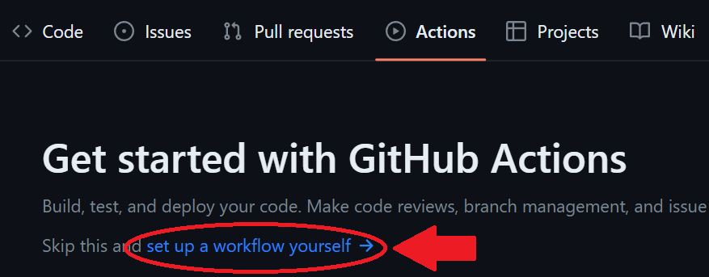

# IT4883Q_Project_Group5
## Description

Task-Manager is an open source, featureful app which is an effective assistant on dealing with a huge of task

## Highlights

- Light, Dark  Themes
- Local & Global Customizable Keyboard Shortcuts
- List Navigation
- Scalable Interface
- Update Notifications

## Contents

- [Description](#description)
- [Highlights](#highlights)
- [Features](#features)
- [Development](#development)

## Features

Visit the project homepage to view all features in detail.

- Task list: can create, edit, and delete tasks.

- Due dates and reminders: allow to set due dates and reminders for tasks.

- Prioritization: allow to prioritize tasks, so you can focus on what's most important.

- Categorization and tagging: allow you to categorize and tag tasks, it's convenient to find them later.

- Notes: allow you to add notes or comments to tasks, provide additional details or context.

- Files: allow you to attach files (img, wav,..).

- Syncing: can access your tasks from anywhere.

- Search: allow identify the task for dealing.

- Customization: allow you to customize the look and feel of user, use it comfortably.

- Integration: integrate with other tools (google).

## Build CI/CD Pipeline using Github Action | Build & push Docker Image

Step 1: Add dockerfile to the repo:

<pre>FROM node:19.3.0

WORKDIR /app

COPY package*.json .

RUN npm install

COPY . .

EXPOSE 3000

CMD [ "npm", "start" ]</pre>

Step 2: Go to "Actions" of the current Repo and click on “Set up a workflow yourself”

Step 3: After that, Github Actions will add a folder .github/workflows in the current repo and ask you to create "main.yml" file:
<pre>name: Publish Docker image

on:
  push:
    branches: ['main']

jobs:
  push_to_registry:
    name: Push Docker image to Docker Hub
    runs-on: ubuntu-latest
    steps:
      - name: Check out the repo
        uses: actions/checkout@v3
      
      - name: Log in to Docker Hub
        uses: docker/login-action@f054a8b539a109f9f41c372932f1ae047eff08c9
        with:
          username: ${{ secrets.DOCKER_USERNAME }}
          password: ${{ secrets.DOCKER_PASSWORD }}
      
      - name: Extract metadata (tags, labels) for Docker
        id: meta
        uses: docker/metadata-action@98669ae865ea3cffbcbaa878cf57c20bbf1c6c38
        with:
          images: hung1608/testcicd
      
      - name: Build and push Docker image
        uses: docker/build-push-action@ad44023a93711e3deb337508980b4b5e9bcdc5dc
        with:
          context: .
          push: true
          tags: ${{ steps.meta.outputs.tags }}
          labels: ${{ steps.meta.outputs.labels }}</pre>

Note that you should create variables on Github to store your Docker's username and password instead of putting it directly in the "main.yml" file to avoid information disclosure.

## Development

This repo is responsible for the Task-Manager FE, The API is in [BE Repo](https://github.com/LongNguyenVu24/IT4883Q_Project_Group5-BE.git).

